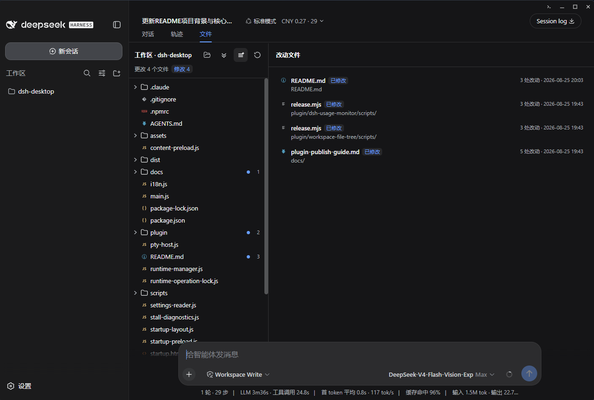
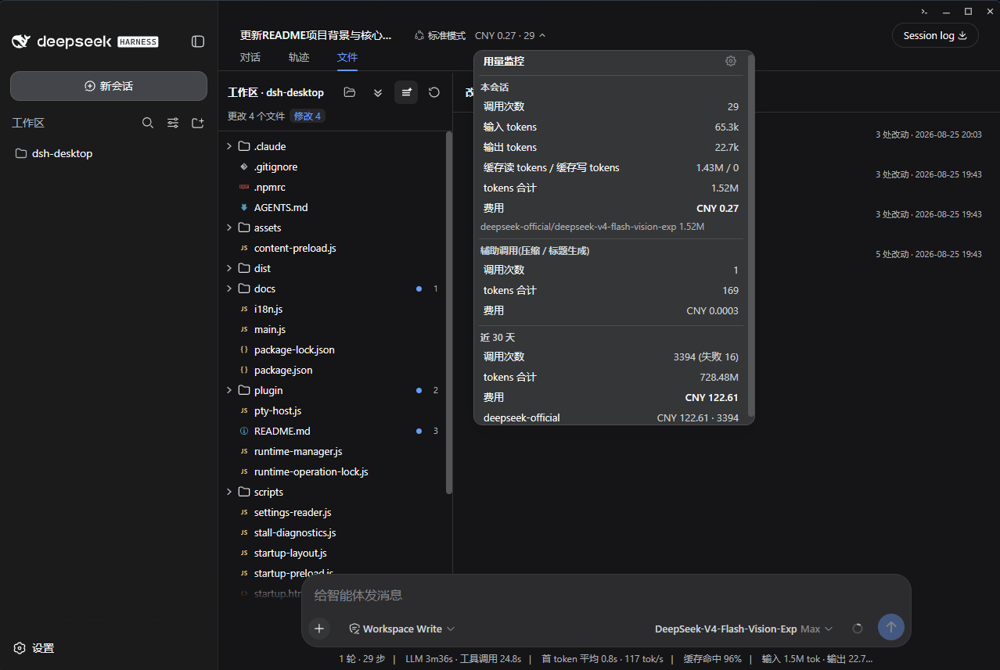

<p align="center">
  
</p>

<h1 align="center">DSH Desktop</h1>

DSH Desktop 是一个面向 Windows 的 DeepSeek Harness（DSH）桌面启动器，加载的是本机 DSH 服务与官方 Web UI，启动器本身不实现界面只在官方界面基础上提供桌面窗口与配套能力，默认跟随 DeepSeek-Harness 官方 npm 包的最新版本。

> 本项目不修改 DSH：加载的是本机 DSH 服务，在官方界面基础上提供桌面窗口。

## 核心能力

- **双击直接启动**：自动检查 Node.js 环境、安装或复用独立的 DSH 运行时、使用系统分配的空闲端口启动 DSH Web 服务，并在原生桌面窗口中加载官方 Web UI，全程无需命令行。
- **跟随官方最新版本**：默认在应用启动后检查 npm registry 上的最新版本（官方源不可达时自动回退镜像源），可在托盘中关闭自动检查，也支持手动检查更新；发现新版本后可在应用内一键更新，随后自动重启 DSH。
- **运行时独立管理**：DSH 以 npm 包形式安装在用户目录 `~/.dshdesktop/runtime/`，不绑定启动器源码或安装包；网络不可用时直接复用已安装版本。
- **内嵌终端面板**：`` Ctrl+` `` 一键打开 PowerShell/cmd 终端（也可通过窗口按钮或托盘「打开终端」），支持多会话、底部/右侧停靠、拖动调整尺寸、会话重命名，随深浅色主题自动切换。

## 快速启动

### 安装运行
本仓库的 `Releases` 中有最新版安装程序，其中 `DSH.Desktop.Setup.<版本号>.exe` 为安装程序，可安装运行； `DSH.Desktop.<版本号>.exe` 为免安装便携版，双击即可启动，但电脑中仍需要 `node` 和 `npm`，并且首次启动要能够联网下载 `DSH`。

### 源码运行

```powershell
git clone <仓库地址>
cd <仓库目录>

npm ci
npm test
npm start
```

各命令用途：

- `npm ci`：严格按照 `package-lock.json` 安装可复现依赖，首次克隆推荐使用。
- `npm test`：执行全部自动化测试（运行时管理、偏好迁移、启动布局、卡住诊断等单元测试）。
- `npm start`：以开发模式运行 `electron .`。

首次启动会把 DSH 下载到 `~/.dshdesktop/runtime/`，可能需要几十秒到几分钟。后续启动会直接复用完整的本地运行时；网络不可用时仍可使用已安装版本。

## 插件生态

DSH Desktop 加载的是 DSH 官方的 `web` profile，因此可以直接为 DSH 安装插件来扩展官方 Web UI。仓库随 GitHub Releases 分发以下自研插件（每个插件均为 host + client 两个 npm 包）。

### 1.workspace-file-tree（工作区文件树与会话改动差异）

在会话视图新增「文件」Tab：显示当前工作区文件树（带 Seti 同源文件类型图标），标记会话期间工作区内**所有**文件变化（agent 工具修改、bash/git 脚本写入、外部编辑器编辑）。点击任意文件可用 CodeMirror 6 语法高亮审阅内容；有变化记录的文件可在标题栏切换「差异」视图，并可切到编辑模式直接修改、保存文件，改动即时计入差异。



### 2.dsh-usage-monitor（跨厂商用量监控）

在会话头部显示实时用量角标（调用次数、token 与费用），点击展开用量监控面板：本会话的输入/输出/缓存读写 token 明细与费用，以及近 30 天按厂商/模型/日期的聚合统计；支持峰谷分时计价与价目表编辑，数据本地保存于 SQLite。



## 插件安装

插件随 GitHub Releases 分发，DSH Desktop 使用的 `web` profile 通过官方 `dsh plugin` 命令安装：

- 从 [Releases](https://github.com/NoBullyMeThanks/DSHDesktop/releases) 下载插件对应版本（如 `plugin-v1.0.0`）的 **host 与 client 两个 tgz**，放到同一目录（如 `D:\plugins`）。
- 在该目录打开 PowerShell，执行安装命令（以 workspace-file-tree 为例）：

  ```powershell
  $dsh = "$env:USERPROFILE\.dshdesktop\runtime\node_modules\@deepseek-ai\dsh\lib\bin.js"
  node $dsh plugin --profile web add file:./workspace-file-tree-client-1.0.0.tgz file:./workspace-file-tree-1.0.0.tgz
  ```

- 彻底退出并重新启动 DSH Desktop（插件在 DSH 服务启动时加载，仅刷新页面不生效）。

> 安装时出现的 `declares no dsh.bundle — installed as a plain dependency` 提示是预期无害的：client 包本身没有 profile 层声明。
> 安装只需 npm registry 可达（公共依赖从官方源安装），安装完成后插件完全本地运行。

## 插件卸载

以 workspace-file-tree 为例：
```powershell
$dsh = "$env:USERPROFILE\.dshdesktop\runtime\node_modules\@deepseek-ai\dsh\lib\bin.js"
node $dsh plugin --profile web remove workspace-file-tree
node $dsh plugin --profile web remove workspace-file-tree-client
```

卸载 dsh-usage-monitor 后如需清理用量数据，可删除 `~/.dsh/storages/usage-monitor.sqlite`。

## 数据目录

| 路径 | 内容 |
|---|---|
| `~/.dshdesktop/runtime/` | DSH Desktop 管理的 DSH npm 运行时 |
| `~/.dshdesktop/version.json` | 当前已安装的 DSH 版本记录 |
| `~/.dshdesktop/preferences.json` | 启动更新检查等桌面端偏好 |
| `~/.dshdesktop/dsh.log` | 桌面启动器和 DSH 子进程日志 |
| `~/.dsh/` | DSH 自身的凭据、设置和会话数据 |

DSH Desktop 与命令行版 DSH 默认共享 `~/.dsh/`。API Key 可以在 DSH Web UI 的 Settings → Models 中配置，也可以通过 DSH 支持的环境变量提供。


## License

MIT
